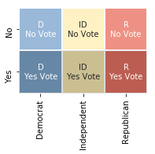
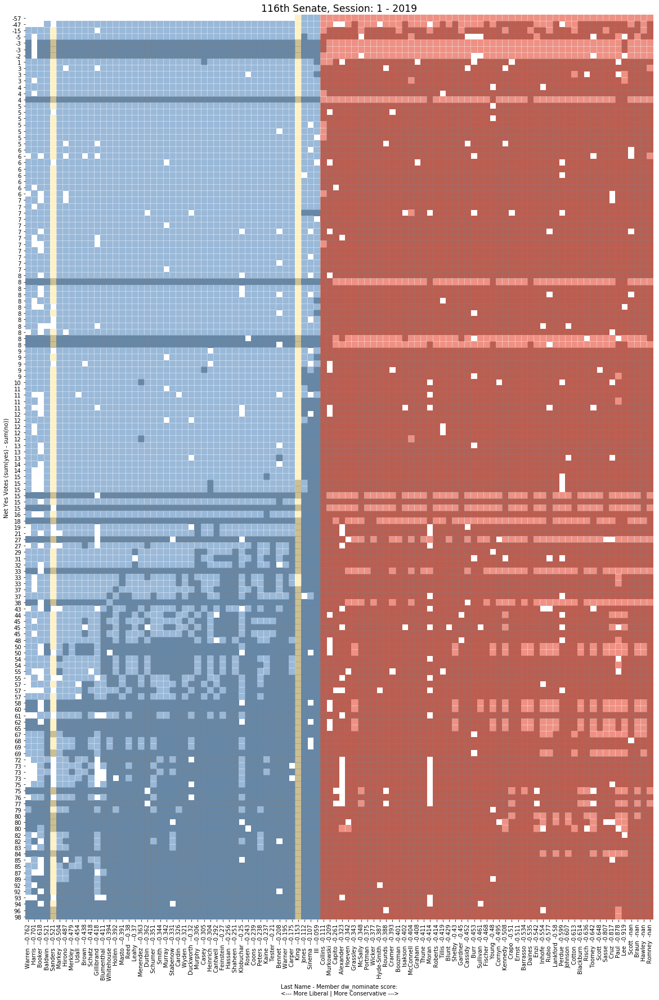
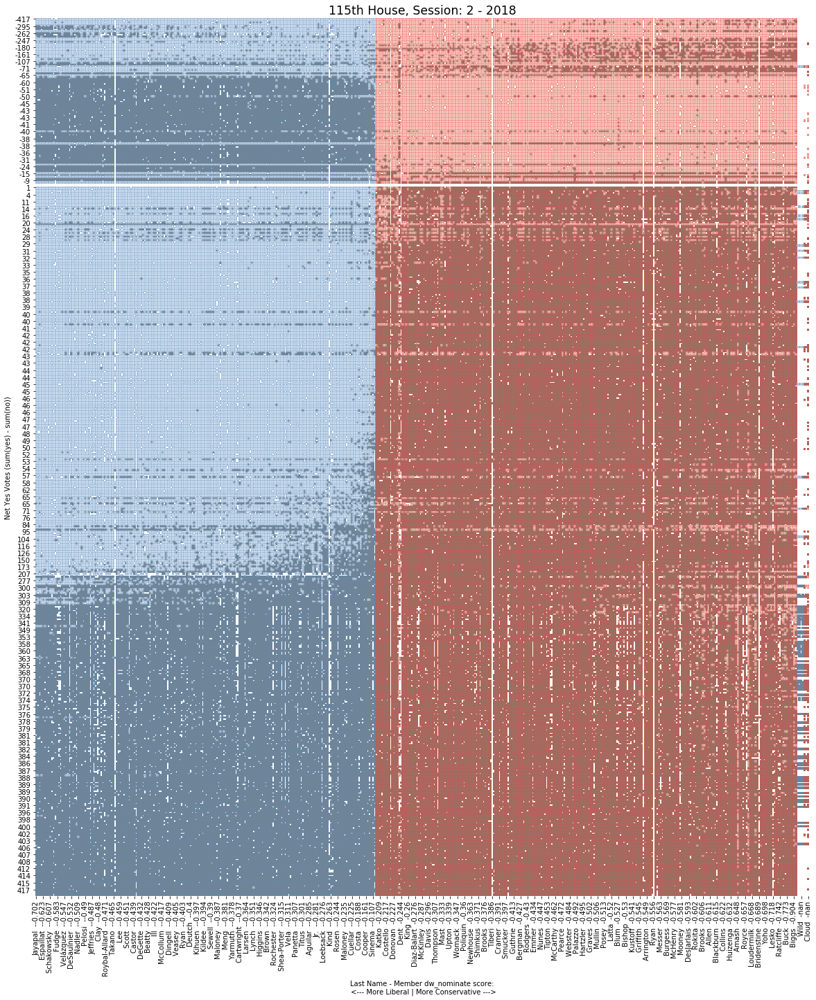
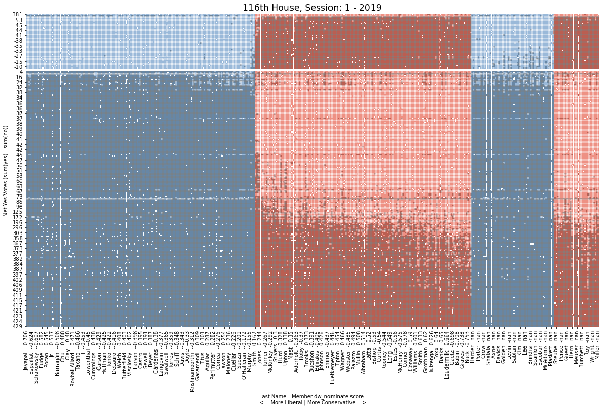

# Capstone Project 2: Congressional Survival

## Problem
Based on their voting history, what type of congress member is most likely to survive in what political environment? 
Election results are highly dependent on voter enthusiasm, partisanlean, and the national political environment.  However, when voting on legislation, members of congress in swing districts must do a cost benefit analysis of meeting the partisan preferences of their district or the expectations of their own base. What type of strategy most successfully predicts survival?

## Client / Stakeholder case:
This information could be useful for any number of congressional members for determining their voting choices, or for National level party organs such as the Democratic National Committee to inform voting strategies. It could also be of interest to any number of political blogs.

## Data Sets
The primary dataset is congressional voting records going back to 1981 available from the House and Senate clerk offices via the [ProPublica Congress API](https://projects.propublica.org/api-docs/congress-api/).

Other datasets, available from fivethirtyeight:
- Partisan lean of districts and states
- Predictions of Partisan votes based on district lean.

### Prospective datasets: 
  The [voteview dataset](https://voteview.com/data) stores congressional voting records and ideological scores going back to the first congress in 1781.

## Data Wrangling and Cleaning:

As the dataset is being fetched via API, wrangling and cleaning focused mostly on constructing the data from individual API requests into a useful format. The Pro Publica Congress API makes metadata for votes available for a given month chamber and year, and each member's position on a given vote available for individual roll call votes for a given congress number, chamber, sesson, and roll call number.

### Steps: 
Created functions to:

1. Request the ProPublica API with an API key for a given end point, and return the response as a dictionary.
2. Repeat failed requests in case of internet reliability issues.
3. Construct an endpoint to request meta data for a given year and month. Return it as a DataFrame.
4. Use the above to request metadata for all months for a given chamber and year, and return a DataFrame multiindexed by congress number, chamber, session, and roll call number of each vote.
5. Take the index of the metadata for a given year and use it to request each member's position for each vote in that year returning a dataframe with the same index, and a multi-index of each members party, state, district, ideological score, unique identifier, and name. 
6. Handle missing vote position data by filling rows with 'NaN' values, and [reporting](https://github.com/propublica/congress-api-docs/issues/226) to ProPublica for resolution. 
7. Take a given year and chamber, return a corosponding dataframe of all the metadata and a seperate dataframe of positions. These functions will check if a there is an existing CSV file for those dataframes in the Data directory, and if so load it. If not, they will construct new dataframes using the API and cac the CSV to the Data directory.

### Example metadata DataFrame (first row):

|                       | bill                                                                                                                                                                                                                                                                                                                                                                                                                                                                                         | date       | democratic                                                                     | description                                                                                                                                                                                                                                                                                         |   document_number | document_title                                                                                                                                                                                                                                                                                      | independent                                        | question                            | question_text                            | republican                                                                      | result                                    | source                                                                               |   tie_breaker |   tie_breaker_vote | time     | total                                                | url                                                                                                             | vote_type   | vote_uri                                                                  |
|-----------------------|----------------------------------------------------------------------------------------------------------------------------------------------------------------------------------------------------------------------------------------------------------------------------------------------------------------------------------------------------------------------------------------------------------------------------------------------------------------------------------------------|------------|--------------------------------------------------------------------------------|-----------------------------------------------------------------------------------------------------------------------------------------------------------------------------------------------------------------------------------------------------------------------------------------------------|-------------------|-----------------------------------------------------------------------------------------------------------------------------------------------------------------------------------------------------------------------------------------------------------------------------------------------------|----------------------------------------------------|-------------------------------------|------------------------------------------|---------------------------------------------------------------------------------|-------------------------------------------|--------------------------------------------------------------------------------------|---------------|--------------------|----------|------------------------------------------------------|-----------------------------------------------------------------------------------------------------------------|-------------|---------------------------------------------------------------------------|
| (116, 'Senate', 1, 1) | {'bill_id': 's1-116', 'number': 'S.1', 'sponsor_id': 'R000595', 'api_uri': 'https://api.propublica.org/congress/v1/116/bills/s1.json', 'title': 'A bill to make improvements to certain defense and security assistance provisions and to authorize the appropriation of funds to Israel, to reauthorize the United States-Jordan Defense Cooperation Act of 2015, and to halt the wholesale slaughter of the Syrian people, and for other purposes.', 'latest_action': 'Held at the desk.'} | 2019-01-08 | {'yes': 4, 'no': 41, 'present': 0, 'not_voting': 0, 'majority_position': 'No'} | A bill to make improvements to certain defense and security assistance provisions and to authorize the appropriation of funds to Israel, to reauthorize the United States-Jordan Defense Cooperation Act of 2015, and to halt the wholesale slaughter of the Syrian people, and for other purposes. |                 1 | A bill to make improvements to certain defense and security assistance provisions and to authorize the appropriation of funds to Israel, to reauthorize the United States-Jordan Defense Cooperation Act of 2015, and to halt the wholesale slaughter of the Syrian people, and for other purposes. | {'yes': 0, 'no': 2, 'present': 0, 'not_voting': 0} | On Cloture on the Motion to Proceed | On Cloture on the Motion to Proceed S. 1 | {'yes': 52, 'no': 1, 'present': 0, 'not_voting': 0, 'majority_position': 'Yes'} | Cloture on the Motion to Proceed Rejected | https://www.senate.gov/legislative/LIS/roll_call_votes/vote1161/vote_116_1_00001.xml |           nan |                nan | 17:39:00 | {'yes': 56, 'no': 44, 'present': 0, 'not_voting': 0} | https://www.senate.gov/legislative/LIS/roll_call_lists/roll_call_vote_cfm.cfm?congress=116&session=1&vote=00001 | 3/5         | https://api.propublica.org/congress/v1/116/senate/sessions/1/votes/1.json |

### Example member position DataFrame (5 rows):

|                       | ('D', 'MA', -0.762, 'W000817', 'Elizabeth Warren')   | ('D', 'CA', -0.701, 'H001075', 'Kamala Harris')   | ('D', 'NJ', -0.618, 'B001288', 'Cory Booker')   | ('D', 'WI', -0.521, 'B001230', 'Tammy Baldwin')   | ('ID', 'VT', -0.521, 'S000033', 'Bernard Sanders')   | ('D', 'MA', -0.504, 'M000133', 'Edward J. Markey')   | ('D', 'HI', -0.487, 'H001042', 'Mazie K. Hirono')   | ('D', 'OR', -0.479, 'M001176', 'Jeff Merkley')   | ('D', 'NM', -0.454, 'U000039', 'Tom Udall')   | ('D', 'OH', -0.438, 'B000944', 'Sherrod Brown')   | ('D', 'HI', -0.418, 'S001194', 'Brian Schatz')   | ('D', 'NY', -0.418, 'G000555', 'Kirsten E. Gillibrand')   | ('D', 'CT', -0.411, 'B001277', 'Richard Blumenthal')   | ('D', 'RI', -0.394, 'W000802', 'Sheldon Whitehouse')   | ('D', 'MD', -0.392, 'V000128', 'Chris Van Hollen')   | ('D', 'NV', -0.391, 'C001113', 'Catherine Cortez Masto')   | ('D', 'RI', -0.38, 'R000122', 'Jack Reed')   | ('D', 'VT', -0.37, 'L000174', 'Patrick J. Leahy')   | ('D', 'NJ', -0.363, 'M000639', 'Robert Menendez')   | ('D', 'IL', -0.362, 'D000563', 'Richard J. Durbin')   | ('D', 'NY', -0.351, 'S000148', 'Charles E. Schumer')   | ('D', 'MN', -0.344, 'S001203', 'Tina Smith')   | ('D', 'WA', -0.342, 'M001111', 'Patty Murray')   | ('D', 'MI', -0.331, 'S000770', 'Debbie Stabenow')   | ('D', 'MD', -0.326, 'C000141', 'Benjamin L. Cardin')   | ('D', 'OR', -0.321, 'W000779', 'Ron Wyden')   | ('D', 'IL', -0.32, 'D000622', 'Tammy Duckworth')   | ('D', 'CT', -0.306, 'M001169', 'Christopher S. Murphy')   | ('D', 'PA', -0.305, 'C001070', 'Bob Casey')   | ('D', 'NM', -0.304, 'H001046', 'Martin Heinrich')   | ('D', 'WA', -0.292, 'C000127', 'Maria Cantwell')   | ('D', 'CA', -0.27, 'F000062', 'Dianne Feinstein')   | ('D', 'NH', -0.256, 'H001076', 'Margaret Hassan')   | ('D', 'NH', -0.251, 'S001181', 'Jeanne Shaheen')   | ('D', 'MN', -0.25, 'K000367', 'Amy Klobuchar')   | ('D', 'NV', -0.243, 'R000608', 'Jacky Rosen')   | ('D', 'DE', -0.239, 'C001088', 'Christopher A. Coons')   | ('D', 'MI', -0.238, 'P000595', 'Gary Peters')   | ('D', 'VA', -0.237, 'K000384', 'Tim Kaine')   | ('D', 'MT', -0.21, 'T000464', 'Jon Tester')   | ('D', 'CO', -0.208, 'B001267', 'Michael Bennet')   | ('D', 'VA', -0.195, 'W000805', 'Mark Warner')   | ('D', 'DE', -0.175, 'C000174', 'Thomas R. Carper')   | ('ID', 'ME', -0.153, 'K000383', 'Angus King')   | ('D', 'AL', -0.112, 'J000300', 'Doug Jones')   | ('D', 'AZ', -0.107, 'S001191', 'Kyrsten Sinema')   | ('D', 'WV', -0.059, 'M001183', 'Joe Manchin III')   | ('R', 'ME', 0.111, 'C001035', 'Susan Collins')   | ('R', 'AK', 0.209, 'M001153', 'Lisa Murkowski')   | ('R', 'WV', 0.261, 'C001047', 'Shelley Moore Capito')   | ('R', 'TN', 0.323, 'A000360', 'Lamar Alexander')   | ('R', 'ND', 0.342, 'H001061', 'John Hoeven')   | ('R', 'IA', 0.343, 'G000386', 'Charles E. Grassley')   | ('R', 'AZ', 0.348, 'M001197', 'Martha McSally')   | ('R', 'OH', 0.375, 'P000449', 'Rob Portman')   | ('R', 'MS', 0.377, 'W000437', 'Roger Wicker')   | ('R', 'MS', 0.387, 'H001079', 'Cindy Hyde-Smith')   | ('R', 'SD', 0.388, 'R000605', 'Mike Rounds')   | ('R', 'ND', 0.393, 'C001096', 'Kevin Cramer')   | ('R', 'AR', 0.401, 'B001236', 'John Boozman')   | ('R', 'GA', 0.402, 'I000055', 'Johnny Isakson')   | ('R', 'KY', 0.404, 'M000355', 'Mitch McConnell')   | ('R', 'SC', 0.408, 'G000359', 'Lindsey Graham')   | ('R', 'SD', 0.411, 'T000250', 'John Thune')   | ('R', 'KS', 0.414, 'M000934', 'Jerry Moran')   | ('R', 'KS', 0.414, 'R000307', 'Pat Roberts')   | ('R', 'NC', 0.419, 'T000476', 'Thom Tillis')   | ('R', 'MO', 0.429, 'B000575', 'Roy Blunt')   | ('R', 'AL', 0.43, 'S000320', 'Richard C. Shelby')   | ('R', 'CO', 0.45, 'G000562', 'Cory Gardner')   | ('R', 'LA', 0.452, 'C001075', 'Bill Cassidy')   | ('R', 'NC', 0.453, 'B001135', 'Richard M. Burr')   | ('R', 'AK', 0.461, 'S001198', 'Dan Sullivan')   | ('R', 'NE', 0.468, 'F000463', 'Deb Fischer')   | ('R', 'IN', 0.48, 'Y000064', 'Todd Young')   | ('R', 'TX', 0.495, 'C001056', 'John Cornyn')   | ('R', 'LA', 0.508, 'K000393', 'John Kennedy')   | ('R', 'ID', 0.51, 'C000880', 'Michael D. Crapo')   | ('R', 'IA', 0.511, 'E000295', 'Joni Ernst')   | ('R', 'WY', 0.534, 'B001261', 'John Barrasso')   | ('R', 'MT', 0.535, 'D000618', 'Steve Daines')   | ('R', 'WY', 0.542, 'E000285', 'Michael B. Enzi')   | ('R', 'OK', 0.554, 'I000024', 'James M. Inhofe')   | ('R', 'FL', 0.577, 'R000595', 'Marco Rubio')   | ('R', 'OK', 0.58, 'L000575', 'James Lankford')   | ('R', 'GA', 0.599, 'P000612', 'David Perdue')   | ('R', 'WI', 0.607, 'J000293', 'Ron Johnson')   | ('R', 'AR', 0.613, 'C001095', 'Tom Cotton')   | ('R', 'TN', 0.614, 'B001243', 'Marsha Blackburn')   | ('R', 'ID', 0.636, 'R000584', 'Jim Risch')   | ('R', 'PA', 0.642, 'T000461', 'Patrick J. Toomey')   | ('R', 'SC', 0.648, 'S001184', 'Tim Scott')   | ('R', 'NE', 0.807, 'S001197', 'Ben Sasse')   | ('R', 'TX', 0.817, 'C001098', 'Ted Cruz')   | ('R', 'KY', 0.878, 'P000603', 'Rand Paul')   | ('R', 'UT', 0.919, 'L000577', 'Mike Lee')   | ('R', 'FL', nan, 'S001217', 'Rick Scott')   | ('R', 'IN', nan, 'B001310', 'Mike Braun')   | ('R', 'MO', nan, 'H001089', 'Joshua Hawley')   | ('R', 'UT', nan, 'R000615', 'Mitt Romney')   |
|-----------------------|------------------------------------------------------|---------------------------------------------------|-------------------------------------------------|---------------------------------------------------|------------------------------------------------------|------------------------------------------------------|-----------------------------------------------------|--------------------------------------------------|-----------------------------------------------|---------------------------------------------------|--------------------------------------------------|-----------------------------------------------------------|--------------------------------------------------------|--------------------------------------------------------|------------------------------------------------------|------------------------------------------------------------|----------------------------------------------|-----------------------------------------------------|-----------------------------------------------------|-------------------------------------------------------|--------------------------------------------------------|------------------------------------------------|--------------------------------------------------|-----------------------------------------------------|--------------------------------------------------------|-----------------------------------------------|----------------------------------------------------|-----------------------------------------------------------|-----------------------------------------------|-----------------------------------------------------|----------------------------------------------------|-----------------------------------------------------|-----------------------------------------------------|----------------------------------------------------|--------------------------------------------------|-------------------------------------------------|----------------------------------------------------------|-------------------------------------------------|-----------------------------------------------|-----------------------------------------------|----------------------------------------------------|-------------------------------------------------|------------------------------------------------------|-------------------------------------------------|------------------------------------------------|----------------------------------------------------|-----------------------------------------------------|--------------------------------------------------|---------------------------------------------------|---------------------------------------------------------|----------------------------------------------------|------------------------------------------------|--------------------------------------------------------|---------------------------------------------------|------------------------------------------------|-------------------------------------------------|-----------------------------------------------------|------------------------------------------------|-------------------------------------------------|-------------------------------------------------|---------------------------------------------------|----------------------------------------------------|---------------------------------------------------|-----------------------------------------------|------------------------------------------------|------------------------------------------------|------------------------------------------------|----------------------------------------------|-----------------------------------------------------|------------------------------------------------|-------------------------------------------------|----------------------------------------------------|-------------------------------------------------|------------------------------------------------|----------------------------------------------|------------------------------------------------|-------------------------------------------------|----------------------------------------------------|-----------------------------------------------|--------------------------------------------------|-------------------------------------------------|----------------------------------------------------|----------------------------------------------------|------------------------------------------------|--------------------------------------------------|-------------------------------------------------|------------------------------------------------|-----------------------------------------------|-----------------------------------------------------|----------------------------------------------|------------------------------------------------------|----------------------------------------------|----------------------------------------------|---------------------------------------------|----------------------------------------------|---------------------------------------------|---------------------------------------------|---------------------------------------------|------------------------------------------------|----------------------------------------------|
| (116, 'Senate', 1, 1) | No                                                   | No                                                | No                                              | No                                                | No                                                   | No                                                   | No                                                  | No                                               | No                                            | No                                                | No                                               | No                                                        | No                                                     | No                                                     | No                                                   | No                                                         | No                                           | No                                                  | Yes                                                 | No                                                    | No                                                     | No                                             | No                                               | No                                                  | No                                                     | No                                            | No                                                 | No                                                        | No                                            | No                                                  | No                                                 | No                                                  | No                                                  | No                                                 | No                                               | No                                              | No                                                       | No                                              | No                                            | No                                            | No                                                 | No                                              | No                                                   | No                                              | Yes                                            | Yes                                                | Yes                                                 | Yes                                              | Yes                                               | Yes                                                     | Yes                                                | Yes                                            | Yes                                                    | Yes                                               | Yes                                            | Yes                                             | Yes                                                 | Yes                                            | Yes                                             | Yes                                             | Yes                                               | No                                                 | Yes                                               | Yes                                           | Yes                                            | Yes                                            | Yes                                            | Yes                                          | Yes                                                 | Yes                                            | Yes                                             | Yes                                                | Yes                                             | Yes                                            | Yes                                          | Yes                                            | Yes                                             | Yes                                                | Yes                                           | Yes                                              | Yes                                             | Yes                                                | Yes                                                | Yes                                            | Yes                                              | Yes                                             | Yes                                            | Yes                                           | Yes                                                 | Yes                                          | Yes                                                  | Yes                                          | Yes                                          | Yes                                         | Yes                                          | Yes                                         | Yes                                         | Yes                                         | Yes                                            | Yes                                          |
| (116, 'Senate', 1, 2) | No                                                   | No                                                | No                                              | No                                                | No                                                   | No                                                   | No                                                  | No                                               | No                                            | No                                                | No                                               | No                                                        | No                                                     | No                                                     | No                                                   | No                                                         | No                                           | No                                                  | Yes                                                 | No                                                    | No                                                     | No                                             | No                                               | No                                                  | No                                                     | No                                            | No                                                 | No                                                        | No                                            | No                                                  | No                                                 | No                                                  | No                                                  | No                                                 | No                                               | No                                              | No                                                       | No                                              | No                                            | No                                            | No                                                 | No                                              | No                                                   | No                                              | Yes                                            | Yes                                                | Yes                                                 | Yes                                              | Yes                                               | Yes                                                     | Yes                                                | Yes                                            | Yes                                                    | Yes                                               | Yes                                            | Yes                                             | Yes                                                 | Yes                                            | Yes                                             | Yes                                             | Yes                                               | Yes                                                | Yes                                               | Yes                                           | Not Voting                                     | Yes                                            | Yes                                            | Yes                                          | Yes                                                 | Yes                                            | Yes                                             | Yes                                                | Yes                                             | Yes                                            | Yes                                          | Not Voting                                     | Yes                                             | Yes                                                | Yes                                           | Yes                                              | Yes                                             | Yes                                                | Yes                                                | Yes                                            | Yes                                              | Not Voting                                      | Yes                                            | Yes                                           | Yes                                                 | Yes                                          | Yes                                                  | Yes                                          | Yes                                          | Not Voting                                  | Yes                                          | Yes                                         | Yes                                         | Yes                                         | Yes                                            | Yes                                          |
| (116, 'Senate', 1, 3) | No                                                   | No                                                | No                                              | No                                                | No                                                   | No                                                   | No                                                  | No                                               | No                                            | No                                                | No                                               | No                                                        | No                                                     | No                                                     | No                                                   | No                                                         | No                                           | No                                                  | No                                                  | Not Voting                                            | No                                                     | No                                             | No                                               | No                                                  | No                                                     | No                                            | Not Voting                                         | No                                                        | No                                            | No                                                  | No                                                 | No                                                  | No                                                  | No                                                 | No                                               | No                                              | No                                                       | No                                              | No                                            | No                                            | No                                                 | No                                              | No                                                   | No                                              | Yes                                            | Yes                                                | Yes                                                 | Yes                                              | Yes                                               | Yes                                                     | Yes                                                | Yes                                            | Yes                                                    | Yes                                               | Yes                                            | Yes                                             | Yes                                                 | Yes                                            | Yes                                             | Yes                                             | Not Voting                                        | No                                                 | Yes                                               | Yes                                           | Not Voting                                     | Yes                                            | Yes                                            | Yes                                          | Yes                                                 | Yes                                            | Yes                                             | Not Voting                                         | Yes                                             | Yes                                            | Yes                                          | Yes                                            | Yes                                             | Not Voting                                         | Yes                                           | Yes                                              | Yes                                             | Yes                                                | Yes                                                | Yes                                            | Yes                                              | Not Voting                                      | Yes                                            | Yes                                           | Yes                                                 | Yes                                          | Yes                                                  | Yes                                          | Yes                                          | Yes                                         | Yes                                          | Yes                                         | Yes                                         | Yes                                         | Yes                                            | Yes                                          |
| (116, 'Senate', 1, 4) | No                                                   | No                                                | No                                              | No                                                | No                                                   | No                                                   | No                                                  | No                                               | No                                            | No                                                | No                                               | Not Voting                                                | No                                                     | No                                                     | No                                                   | No                                                         | No                                           | No                                                  | No                                                  | No                                                    | No                                                     | No                                             | No                                               | No                                                  | No                                                     | No                                            | No                                                 | No                                                        | No                                            | No                                                  | No                                                 | No                                                  | No                                                  | No                                                 | No                                               | No                                              | No                                                       | No                                              | No                                            | No                                            | No                                                 | No                                              | No                                                   | No                                              | No                                             | No                                                 | No                                                  | No                                               | Yes                                               | Yes                                                     | Yes                                                | Yes                                            | Yes                                                    | No                                                | Yes                                            | Yes                                             | Yes                                                 | Yes                                            | Yes                                             | No                                              | Yes                                               | Yes                                                | Yes                                               | Yes                                           | No                                             | Yes                                            | Yes                                            | Yes                                          | Yes                                                 | No                                             | Yes                                             | Yes                                                | Yes                                             | Yes                                            | Yes                                          | Yes                                            | No                                              | Yes                                                | Yes                                           | Yes                                              | No                                              | Yes                                                | Yes                                                | No                                             | Yes                                              | Yes                                             | Yes                                            | No                                            | Yes                                                 | Yes                                          | Yes                                                  | Yes                                          | No                                           | Yes                                         | Yes                                          | Yes                                         | Yes                                         | Yes                                         | No                                             | Yes                                          |
| (116, 'Senate', 1, 5) | Yes                                                  | Yes                                               | Yes                                             | Yes                                               | Yes                                                  | Yes                                                  | Yes                                                 | Yes                                              | Yes                                           | Yes                                               | Yes                                              | Not Voting                                                | Yes                                                    | Yes                                                    | Yes                                                  | Yes                                                        | Yes                                          | Yes                                                 | Yes                                                 | Yes                                                   | Yes                                                    | Yes                                            | Yes                                              | Yes                                                 | Yes                                                    | Yes                                           | Yes                                                | Yes                                                       | Yes                                           | Yes                                                 | Yes                                                | Yes                                                 | Yes                                                 | Yes                                                | Yes                                              | Yes                                             | Yes                                                      | Yes                                             | Yes                                           | Yes                                           | Yes                                                | Yes                                             | Yes                                                  | Yes                                             | Yes                                            | Yes                                                | Yes                                                 | Yes                                              | No                                                | No                                                      | No                                                 | No                                             | No                                                     | Yes                                               | No                                             | No                                              | No                                                  | No                                             | No                                              | Yes                                             | No                                                | No                                                 | No                                                | No                                            | Yes                                            | No                                             | No                                             | No                                           | No                                                  | Yes                                            | No                                              | No                                                 | No                                              | No                                             | No                                           | No                                             | Yes                                             | No                                                 | No                                            | No                                               | Yes                                             | No                                                 | No                                                 | Yes                                            | No                                               | No                                              | No                                             | Yes                                           | No                                                  | No                                           | No                                                   | No                                           | Yes                                          | No                                          | No                                           | No                                          | No                                          | No                                          | Yes                                            | No                                           |

## Exploritory Data Analysis

