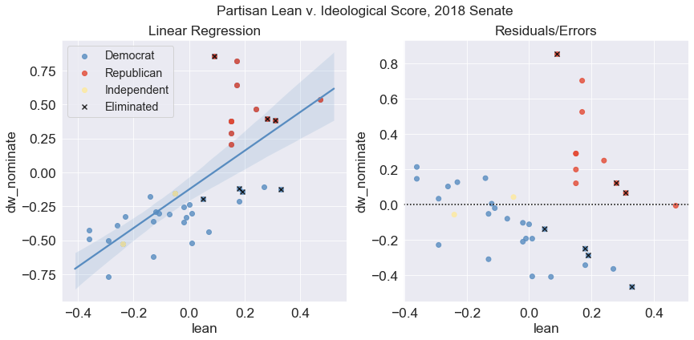
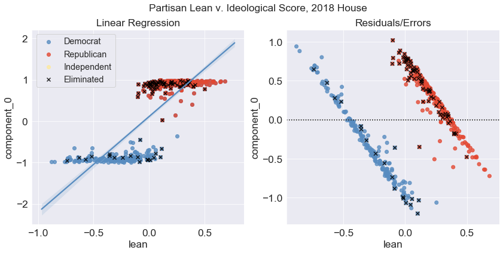
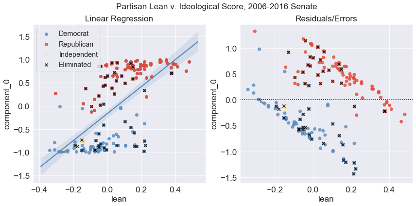
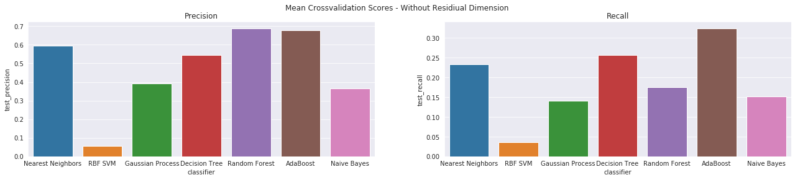

# Capstone Project 2: Congressional Survival

## Problem
Based on their voting history, what type of congressional member is most likely to survive in what political environment?
Election results are highly dependent on voter enthusiasm, partisan lean, and the national political environment.  However, when voting on legislation, members of congress in swing districts must do a cost benefit analysis of meeting the partisan preferences of their district or the expectations of their own base. What type of strategy most successfully predicts survival?

## Client / Stakeholder case:
Audrey Denney is a  Democratic congresswoman from California District 1, she was recently elected after a very close contest with Doug LaMalfa in 2020, riding the historic blue wave that swept Trump out of office. CA-1 is a rural, traditionally Republican district with a partisan lean of R+22.53. She wants to know what type of voting strategy will help her survive next election. Other stakeholders include could a National level party organ such as the Democratic National Committee looking to inform voting strategy.

## Data Sets

  
- congressional voting records going back to 1981 available from the House and Senate clerk offices via the [ProPublica Congress API](https://projects.propublica.org/api-docs/congress-api).

- Partisan lean of [districts](Data/fivethirtyeight_partisan_lean_DISTRICTS.csv) and [states](Data/fivethirtyeight_partisan_lean_STATES.csv) available from [FiveThirtyEight](https://github.com/fivethirtyeight/data/):

Partisan lean is the average difference between how a state or district votes and how the country votes overall, with 2016 presidential election results weighted 50 percent, 2012 presidential election results weighted 25 percent and results from elections for the state legislature weighted 25 percent.

## Data Wrangling and Cleaning:

As the dataset is being fetched via API, wrangling and cleaning focused mostly on constructing the data from individual API requests into a useful format. The ProPublica Congress API makes metadata for votes available for a given month, chamber (House or Senate)  and year, and each member's position on a given vote available for individual roll call votes for a given congress number, chamber, session, and roll call number.  Requests for chunks of this data were iteratively built into DataFrames for further analysis.

### Example API endpoint:
GET https://api.propublica.org/congress/v1/{congress}/{chamber}/sessions/{session-number}/votes/{roll-call-number}.json

### Steps:

Created functions to:

1. Request the ProPublica API for a given end point, and return the response as a dictionary.
2. Repeat failed requests in case of Internet reliability issues.
3. Construct an endpoint to request meta data for a given year and month. Return it as a DataFrame.
4. Use the above to request metadata for all months for a given chamber and year, and return a [tidy](https://en.wikipedia.org/wiki/Tidy_data) Pandas DataFrame multi-indexed by congress number, chamber, session, and roll call number of each vote.
5. Take the index of the metadata for a given year and use it to request each member's position for each vote in that year. Return a tidy DataFrame with the same index, and construct columns using a multi-index of each member's party, state, district, ideological score, unique identifier, and name.
6. Handle missing vote position data by filling rows with 'NaN' values (these were [reported](https://github.com/propublica/congress-api-docs/issues/226) to ProPublica for resolution).
7. Take a given year and chamber, return a corresponding DataFrame of all the metadata and a separate DataFrame of positions. Check if there is an existing CSV file for those DataFrames in the Data/cache directory, and if so load it. If not, construct new DataFrames using the API and cache the CSV to the Data directory. Update data for the current session if a given time frame has passed since the last cache inserting the delta of what has changed since the last session. This function can be called by subsequent visualization code in order to efficiently return the required session. CSV format was chosen for open data purposes.
8. Convert district lean from  FiveThirtyEight from positive (R+x|D+x) values into continuous -1 to +1 scale compatible with ideological score.

Note: The [Pandas](https://pandas.pydata.org/) versions 2.42 is required a multi-index by floats. A version check was added for this.
### Example metadata DataFrame (first row):

|                       | bill                                                                                                                                                                                                                                                                                                                                                                                                                                                                                         | date       | democratic                                                                     | description                                                                                                                                                                                                                                                                                         |   document_number | document_title                                                                                                                                                                                                                                                                                      | independent                                        | question                            | question_text                            | republican                                                                      | result                                    | source                                                                               |   tie_breaker |   tie_breaker_vote | time     | total                                                | url                                                                                                             | vote_type   | vote_uri                                                                  |
|-----------------------|----------------------------------------------------------------------------------------------------------------------------------------------------------------------------------------------------------------------------------------------------------------------------------------------------------------------------------------------------------------------------------------------------------------------------------------------------------------------------------------------|------------|--------------------------------------------------------------------------------|-----------------------------------------------------------------------------------------------------------------------------------------------------------------------------------------------------------------------------------------------------------------------------------------------------|-------------------|-----------------------------------------------------------------------------------------------------------------------------------------------------------------------------------------------------------------------------------------------------------------------------------------------------|----------------------------------------------------|-------------------------------------|------------------------------------------|---------------------------------------------------------------------------------|-------------------------------------------|--------------------------------------------------------------------------------------|---------------|--------------------|----------|------------------------------------------------------|-----------------------------------------------------------------------------------------------------------------|-------------|---------------------------------------------------------------------------|
| (116, 'Senate', 1, 1) | {'bill_id': 's1-116', 'number': 'S.1', 'sponsor_id': 'R000595', 'api_uri': 'https://api.propublica.org/congress/v1/116/bills/s1.json', 'title': 'A bill to make improvements to certain defense and security assistance provisions and to authorize the appropriation of funds to Israel, to reauthorize the United States-Jordan Defense Cooperation Act of 2015, and to halt the wholesale slaughter of the Syrian people, and for other purposes.', 'latest_action': 'Held at the desk.'} | 2019-01-08 | {'yes': 4, 'no': 41, 'present': 0, 'not_voting': 0, 'majority_position': 'No'} | A bill to make improvements to certain defense and security assistance provisions and to authorize the appropriation of funds to Israel, to reauthorize the United States-Jordan Defense Cooperation Act of 2015, and to halt the wholesale slaughter of the Syrian people, and for other purposes. |                 1 | A bill to make improvements to certain defense and security assistance provisions and to authorize the appropriation of funds to Israel, to reauthorize the United States-Jordan Defense Cooperation Act of 2015, and to halt the wholesale slaughter of the Syrian people, and for other purposes. | {'yes': 0, 'no': 2, 'present': 0, 'not_voting': 0} | On Cloture on the Motion to Proceed | On Cloture on the Motion to Proceed S. 1 | {'yes': 52, 'no': 1, 'present': 0, 'not_voting': 0, 'majority_position': 'Yes'} | Cloture on the Motion to Proceed Rejected | https://www.senate.gov/legislative/LIS/roll_call_votes/vote1161/vote_116_1_00001.xml |           nan |                nan | 17:39:00 | {'yes': 56, 'no': 44, 'present': 0, 'not_voting': 0} | https://www.senate.gov/legislative/LIS/roll_call_lists/roll_call_vote_cfm.cfm?congress=116&session=1&vote=00001 | 3/5         | https://api.propublica.org/congress/v1/116/senate/sessions/1/votes/1.json |

### Example member position DataFrame (5 rows, sorted by ideological score):

|                       | ('D', 'MA', -0.762, 'W000817', 'Elizabeth Warren')   | ('D', 'CA', -0.701, 'H001075', 'Kamala Harris')   | ('D', 'NJ', -0.618, 'B001288', 'Cory Booker')   | ('D', 'WI', -0.521, 'B001230', 'Tammy Baldwin')   | ('ID', 'VT', -0.521, 'S000033', 'Bernard Sanders')   | ('D', 'MA', -0.504, 'M000133', 'Edward J. Markey')   | ('D', 'HI', -0.487, 'H001042', 'Mazie K. Hirono')   | ('D', 'OR', -0.479, 'M001176', 'Jeff Merkley')   | ('D', 'NM', -0.454, 'U000039', 'Tom Udall')   | ('D', 'OH', -0.438, 'B000944', 'Sherrod Brown')   | ('D', 'HI', -0.418, 'S001194', 'Brian Schatz')   | ('D', 'NY', -0.418, 'G000555', 'Kirsten E. Gillibrand')   | ('D', 'CT', -0.411, 'B001277', 'Richard Blumenthal')   | ('D', 'RI', -0.394, 'W000802', 'Sheldon Whitehouse')   | ('D', 'MD', -0.392, 'V000128', 'Chris Van Hollen')   | ('D', 'NV', -0.391, 'C001113', 'Catherine Cortez Masto')   | ('D', 'RI', -0.38, 'R000122', 'Jack Reed')   | ('D', 'VT', -0.37, 'L000174', 'Patrick J. Leahy')   | ('D', 'NJ', -0.363, 'M000639', 'Robert Menendez')   | ('D', 'IL', -0.362, 'D000563', 'Richard J. Durbin')   | ('D', 'NY', -0.351, 'S000148', 'Charles E. Schumer')   | ('D', 'MN', -0.344, 'S001203', 'Tina Smith')   | ('D', 'WA', -0.342, 'M001111', 'Patty Murray')   | ('D', 'MI', -0.331, 'S000770', 'Debbie Stabenow')   | ('D', 'MD', -0.326, 'C000141', 'Benjamin L. Cardin')   | ('D', 'OR', -0.321, 'W000779', 'Ron Wyden')   | ('D', 'IL', -0.32, 'D000622', 'Tammy Duckworth')   | ('D', 'CT', -0.306, 'M001169', 'Christopher S. Murphy')   | ('D', 'PA', -0.305, 'C001070', 'Bob Casey')   | ('D', 'NM', -0.304, 'H001046', 'Martin Heinrich')   | ('D', 'WA', -0.292, 'C000127', 'Maria Cantwell')   | ('D', 'CA', -0.27, 'F000062', 'Dianne Feinstein')   | ('D', 'NH', -0.256, 'H001076', 'Margaret Hassan')   | ('D', 'NH', -0.251, 'S001181', 'Jeanne Shaheen')   | ('D', 'MN', -0.25, 'K000367', 'Amy Klobuchar')   | ('D', 'NV', -0.243, 'R000608', 'Jacky Rosen')   | ('D', 'DE', -0.239, 'C001088', 'Christopher A. Coons')   | ('D', 'MI', -0.238, 'P000595', 'Gary Peters')   | ('D', 'VA', -0.237, 'K000384', 'Tim Kaine')   | ('D', 'MT', -0.21, 'T000464', 'Jon Tester')   | ('D', 'CO', -0.208, 'B001267', 'Michael Bennet')   | ('D', 'VA', -0.195, 'W000805', 'Mark Warner')   | ('D', 'DE', -0.175, 'C000174', 'Thomas R. Carper')   | ('ID', 'ME', -0.153, 'K000383', 'Angus King')   | ('D', 'AL', -0.112, 'J000300', 'Doug Jones')   | ('D', 'AZ', -0.107, 'S001191', 'Kyrsten Sinema')   | ('D', 'WV', -0.059, 'M001183', 'Joe Manchin III')   | ('R', 'ME', 0.111, 'C001035', 'Susan Collins')   | ('R', 'AK', 0.209, 'M001153', 'Lisa Murkowski')   | ('R', 'WV', 0.261, 'C001047', 'Shelley Moore Capito')   | ('R', 'TN', 0.323, 'A000360', 'Lamar Alexander')   | ('R', 'ND', 0.342, 'H001061', 'John Hoeven')   | ('R', 'IA', 0.343, 'G000386', 'Charles E. Grassley')   | ('R', 'AZ', 0.348, 'M001197', 'Martha McSally')   | ('R', 'OH', 0.375, 'P000449', 'Rob Portman')   | ('R', 'MS', 0.377, 'W000437', 'Roger Wicker')   | ('R', 'MS', 0.387, 'H001079', 'Cindy Hyde-Smith')   | ('R', 'SD', 0.388, 'R000605', 'Mike Rounds')   | ('R', 'ND', 0.393, 'C001096', 'Kevin Cramer')   | ('R', 'AR', 0.401, 'B001236', 'John Boozman')   | ('R', 'GA', 0.402, 'I000055', 'Johnny Isakson')   | ('R', 'KY', 0.404, 'M000355', 'Mitch McConnell')   | ('R', 'SC', 0.408, 'G000359', 'Lindsey Graham')   | ('R', 'SD', 0.411, 'T000250', 'John Thune')   | ('R', 'KS', 0.414, 'M000934', 'Jerry Moran')   | ('R', 'KS', 0.414, 'R000307', 'Pat Roberts')   | ('R', 'NC', 0.419, 'T000476', 'Thom Tillis')   | ('R', 'MO', 0.429, 'B000575', 'Roy Blunt')   | ('R', 'AL', 0.43, 'S000320', 'Richard C. Shelby')   | ('R', 'CO', 0.45, 'G000562', 'Cory Gardner')   | ('R', 'LA', 0.452, 'C001075', 'Bill Cassidy')   | ('R', 'NC', 0.453, 'B001135', 'Richard M. Burr')   | ('R', 'AK', 0.461, 'S001198', 'Dan Sullivan')   | ('R', 'NE', 0.468, 'F000463', 'Deb Fischer')   | ('R', 'IN', 0.48, 'Y000064', 'Todd Young')   | ('R', 'TX', 0.495, 'C001056', 'John Cornyn')   | ('R', 'LA', 0.508, 'K000393', 'John Kennedy')   | ('R', 'ID', 0.51, 'C000880', 'Michael D. Crapo')   | ('R', 'IA', 0.511, 'E000295', 'Joni Ernst')   | ('R', 'WY', 0.534, 'B001261', 'John Barrasso')   | ('R', 'MT', 0.535, 'D000618', 'Steve Daines')   | ('R', 'WY', 0.542, 'E000285', 'Michael B. Enzi')   | ('R', 'OK', 0.554, 'I000024', 'James M. Inhofe')   | ('R', 'FL', 0.577, 'R000595', 'Marco Rubio')   | ('R', 'OK', 0.58, 'L000575', 'James Lankford')   | ('R', 'GA', 0.599, 'P000612', 'David Perdue')   | ('R', 'WI', 0.607, 'J000293', 'Ron Johnson')   | ('R', 'AR', 0.613, 'C001095', 'Tom Cotton')   | ('R', 'TN', 0.614, 'B001243', 'Marsha Blackburn')   | ('R', 'ID', 0.636, 'R000584', 'Jim Risch')   | ('R', 'PA', 0.642, 'T000461', 'Patrick J. Toomey')   | ('R', 'SC', 0.648, 'S001184', 'Tim Scott')   | ('R', 'NE', 0.807, 'S001197', 'Ben Sasse')   | ('R', 'TX', 0.817, 'C001098', 'Ted Cruz')   | ('R', 'KY', 0.878, 'P000603', 'Rand Paul')   | ('R', 'UT', 0.919, 'L000577', 'Mike Lee')   | ('R', 'FL', nan, 'S001217', 'Rick Scott')   | ('R', 'IN', nan, 'B001310', 'Mike Braun')   | ('R', 'MO', nan, 'H001089', 'Joshua Hawley')   | ('R', 'UT', nan, 'R000615', 'Mitt Romney')   |
|-----------------------|------------------------------------------------------|---------------------------------------------------|-------------------------------------------------|---------------------------------------------------|------------------------------------------------------|------------------------------------------------------|-----------------------------------------------------|--------------------------------------------------|-----------------------------------------------|---------------------------------------------------|--------------------------------------------------|-----------------------------------------------------------|--------------------------------------------------------|--------------------------------------------------------|------------------------------------------------------|------------------------------------------------------------|----------------------------------------------|-----------------------------------------------------|-----------------------------------------------------|-------------------------------------------------------|--------------------------------------------------------|------------------------------------------------|--------------------------------------------------|-----------------------------------------------------|--------------------------------------------------------|-----------------------------------------------|----------------------------------------------------|-----------------------------------------------------------|-----------------------------------------------|-----------------------------------------------------|----------------------------------------------------|-----------------------------------------------------|-----------------------------------------------------|----------------------------------------------------|--------------------------------------------------|-------------------------------------------------|----------------------------------------------------------|-------------------------------------------------|-----------------------------------------------|-----------------------------------------------|----------------------------------------------------|-------------------------------------------------|------------------------------------------------------|-------------------------------------------------|------------------------------------------------|----------------------------------------------------|-----------------------------------------------------|--------------------------------------------------|---------------------------------------------------|---------------------------------------------------------|----------------------------------------------------|------------------------------------------------|--------------------------------------------------------|---------------------------------------------------|------------------------------------------------|-------------------------------------------------|-----------------------------------------------------|------------------------------------------------|-------------------------------------------------|-------------------------------------------------|---------------------------------------------------|----------------------------------------------------|---------------------------------------------------|-----------------------------------------------|------------------------------------------------|------------------------------------------------|------------------------------------------------|----------------------------------------------|-----------------------------------------------------|------------------------------------------------|-------------------------------------------------|----------------------------------------------------|-------------------------------------------------|------------------------------------------------|----------------------------------------------|------------------------------------------------|-------------------------------------------------|----------------------------------------------------|-----------------------------------------------|--------------------------------------------------|-------------------------------------------------|----------------------------------------------------|----------------------------------------------------|------------------------------------------------|--------------------------------------------------|-------------------------------------------------|------------------------------------------------|-----------------------------------------------|-----------------------------------------------------|----------------------------------------------|------------------------------------------------------|----------------------------------------------|----------------------------------------------|---------------------------------------------|----------------------------------------------|---------------------------------------------|---------------------------------------------|---------------------------------------------|------------------------------------------------|----------------------------------------------|
| (116, 'Senate', 1, 1) | No                                                   | No                                                | No                                              | No                                                | No                                                   | No                                                   | No                                                  | No                                               | No                                            | No                                                | No                                               | No                                                        | No                                                     | No                                                     | No                                                   | No                                                         | No                                           | No                                                  | Yes                                                 | No                                                    | No                                                     | No                                             | No                                               | No                                                  | No                                                     | No                                            | No                                                 | No                                                        | No                                            | No                                                  | No                                                 | No                                                  | No                                                  | No                                                 | No                                               | No                                              | No                                                       | No                                              | No                                            | No                                            | No                                                 | No                                              | No                                                   | No                                              | Yes                                            | Yes                                                | Yes                                                 | Yes                                              | Yes                                               | Yes                                                     | Yes                                                | Yes                                            | Yes                                                    | Yes                                               | Yes                                            | Yes                                             | Yes                                                 | Yes                                            | Yes                                             | Yes                                             | Yes                                               | No                                                 | Yes                                               | Yes                                           | Yes                                            | Yes                                            | Yes                                            | Yes                                          | Yes                                                 | Yes                                            | Yes                                             | Yes                                                | Yes                                             | Yes                                            | Yes                                          | Yes                                            | Yes                                             | Yes                                                | Yes                                           | Yes                                              | Yes                                             | Yes                                                | Yes                                                | Yes                                            | Yes                                              | Yes                                             | Yes                                            | Yes                                           | Yes                                                 | Yes                                          | Yes                                                  | Yes                                          | Yes                                          | Yes                                         | Yes                                          | Yes                                         | Yes                                         | Yes                                         | Yes                                            | Yes                                          |
| (116, 'Senate', 1, 2) | No                                                   | No                                                | No                                              | No                                                | No                                                   | No                                                   | No                                                  | No                                               | No                                            | No                                                | No                                               | No                                                        | No                                                     | No                                                     | No                                                   | No                                                         | No                                           | No                                                  | Yes                                                 | No                                                    | No                                                     | No                                             | No                                               | No                                                  | No                                                     | No                                            | No                                                 | No                                                        | No                                            | No                                                  | No                                                 | No                                                  | No                                                  | No                                                 | No                                               | No                                              | No                                                       | No                                              | No                                            | No                                            | No                                                 | No                                              | No                                                   | No                                              | Yes                                            | Yes                                                | Yes                                                 | Yes                                              | Yes                                               | Yes                                                     | Yes                                                | Yes                                            | Yes                                                    | Yes                                               | Yes                                            | Yes                                             | Yes                                                 | Yes                                            | Yes                                             | Yes                                             | Yes                                               | Yes                                                | Yes                                               | Yes                                           | Not Voting                                     | Yes                                            | Yes                                            | Yes                                          | Yes                                                 | Yes                                            | Yes                                             | Yes                                                | Yes                                             | Yes                                            | Yes                                          | Not Voting                                     | Yes                                             | Yes                                                | Yes                                           | Yes                                              | Yes                                             | Yes                                                | Yes                                                | Yes                                            | Yes                                              | Not Voting                                      | Yes                                            | Yes                                           | Yes                                                 | Yes                                          | Yes                                                  | Yes                                          | Yes                                          | Not Voting                                  | Yes                                          | Yes                                         | Yes                                         | Yes                                         | Yes                                            | Yes                                          |
| (116, 'Senate', 1, 3) | No                                                   | No                                                | No                                              | No                                                | No                                                   | No                                                   | No                                                  | No                                               | No                                            | No                                                | No                                               | No                                                        | No                                                     | No                                                     | No                                                   | No                                                         | No                                           | No                                                  | No                                                  | Not Voting                                            | No                                                     | No                                             | No                                               | No                                                  | No                                                     | No                                            | Not Voting                                         | No                                                        | No                                            | No                                                  | No                                                 | No                                                  | No                                                  | No                                                 | No                                               | No                                              | No                                                       | No                                              | No                                            | No                                            | No                                                 | No                                              | No                                                   | No                                              | Yes                                            | Yes                                                | Yes                                                 | Yes                                              | Yes                                               | Yes                                                     | Yes                                                | Yes                                            | Yes                                                    | Yes                                               | Yes                                            | Yes                                             | Yes                                                 | Yes                                            | Yes                                             | Yes                                             | Not Voting                                        | No                                                 | Yes                                               | Yes                                           | Not Voting                                     | Yes                                            | Yes                                            | Yes                                          | Yes                                                 | Yes                                            | Yes                                             | Not Voting                                         | Yes                                             | Yes                                            | Yes                                          | Yes                                            | Yes                                             | Not Voting                                         | Yes                                           | Yes                                              | Yes                                             | Yes                                                | Yes                                                | Yes                                            | Yes                                              | Not Voting                                      | Yes                                            | Yes                                           | Yes                                                 | Yes                                          | Yes                                                  | Yes                                          | Yes                                          | Yes                                         | Yes                                          | Yes                                         | Yes                                         | Yes                                         | Yes                                            | Yes                                          |
| (116, 'Senate', 1, 4) | No                                                   | No                                                | No                                              | No                                                | No                                                   | No                                                   | No                                                  | No                                               | No                                            | No                                                | No                                               | Not Voting                                                | No                                                     | No                                                     | No                                                   | No                                                         | No                                           | No                                                  | No                                                  | No                                                    | No                                                     | No                                             | No                                               | No                                                  | No                                                     | No                                            | No                                                 | No                                                        | No                                            | No                                                  | No                                                 | No                                                  | No                                                  | No                                                 | No                                               | No                                              | No                                                       | No                                              | No                                            | No                                            | No                                                 | No                                              | No                                                   | No                                              | No                                             | No                                                 | No                                                  | No                                               | Yes                                               | Yes                                                     | Yes                                                | Yes                                            | Yes                                                    | No                                                | Yes                                            | Yes                                             | Yes                                                 | Yes                                            | Yes                                             | No                                              | Yes                                               | Yes                                                | Yes                                               | Yes                                           | No                                             | Yes                                            | Yes                                            | Yes                                          | Yes                                                 | No                                             | Yes                                             | Yes                                                | Yes                                             | Yes                                            | Yes                                          | Yes                                            | No                                              | Yes                                                | Yes                                           | Yes                                              | No                                              | Yes                                                | Yes                                                | No                                             | Yes                                              | Yes                                             | Yes                                            | No                                            | Yes                                                 | Yes                                          | Yes                                                  | Yes                                          | No                                           | Yes                                         | Yes                                          | Yes                                         | Yes                                         | Yes                                         | No                                             | Yes                                          |
| (116, 'Senate', 1, 5) | Yes                                                  | Yes                                               | Yes                                             | Yes                                               | Yes                                                  | Yes                                                  | Yes                                                 | Yes                                              | Yes                                           | Yes                                               | Yes                                              | Not Voting                                                | Yes                                                    | Yes                                                    | Yes                                                  | Yes                                                        | Yes                                          | Yes                                                 | Yes                                                 | Yes                                                   | Yes                                                    | Yes                                            | Yes                                              | Yes                                                 | Yes                                                    | Yes                                           | Yes                                                | Yes                                                       | Yes                                           | Yes                                                 | Yes                                                | Yes                                                 | Yes                                                 | Yes                                                | Yes                                              | Yes                                             | Yes                                                      | Yes                                             | Yes                                           | Yes                                           | Yes                                                | Yes                                             | Yes                                                  | Yes                                             | Yes                                            | Yes                                                | Yes                                                 | Yes                                              | No                                                | No                                                      | No                                                 | No                                             | No                                                     | Yes                                               | No                                             | No                                              | No                                                  | No                                             | No                                              | Yes                                             | No                                                | No                                                 | No                                                | No                                            | Yes                                            | No                                             | No                                             | No                                           | No                                                  | Yes                                            | No                                              | No                                                 | No                                              | No                                             | No                                           | No                                             | Yes                                             | No                                                 | No                                            | No                                               | Yes                                             | No                                                 | No                                                 | Yes                                            | No                                               | No                                              | No                                             | Yes                                           | No                                                  | No                                           | No                                                   | No                                           | Yes                                          | No                                          | No                                           | No                                          | No                                          | No                                          | Yes                                            | No                                           |

## Exploratory Data Analysis
### What patterns are apparent in the data?

This visualization displays each senator’s vote for the current session of congress so far.   Each roll call vote is represented by a row, and each senator, a column, with the parties shaded in their traditional colors.   The senators are sorted by their ideology using a pre-calculated metric (dw_nominate) already available in the data.  This creates a distinct division between Republican and Democrat members, but fits the two independents into different spots within the Democratic side according where they are in the ideological spectrum.  Bernie Sanders, for instance, is registered as an Independent, but placed nearly all the way over to the left. The roll call votes are sorted by how many net yes votes were achieved.  No votes (lighter shades) are subtracted from yes votes (darker shades), excluding any other vote types such as ‘present’ (left blank) to calculate this score. The least popular roll call vote achieved a net vote score of -57, while the most popular achieved 98 net votes.

Because Republicans control which legislation is brought to the floor,  the right column appears almost solid red, as most roll call votes enjoy their support.   Generally, as net support increases so does the support from Democrats, starting with Democrats on the right, and moving further to the left as the overall support becomes more universal, ending with Elizabeth Warren, who has in 2019 has only voted for legislation with near complete Democratic support.   However, support from Republicans seems to mirror this pattern. With roll call votes supported by more than 3 democrats, support tends to build from the left of the party, beginning with Susan Collins, and moving more towards the right as net support increases.

A similar pattern is visible in the current (2019) House. However, since the democrats control the house, it appears in the opposite direction.  Roll calls with more yes than no votes are supported by a solid blue block of Democrat yes votes,  with support from Republicans tending to start on the left and extend toward the right overall support increases.  Roll calls with more no than yes votes are supported by a solid red Republican block. With just a few democrats, tending to the right, voting along with them.  Democrats who are newly elected, and therefore haven’t had their ideological scores calculated, appear over on the right of this visualizations, with a smaller cohort of newly elected republicans.  These Democrats seem to have voted with Republicans a bit more frequently - likely the result of their being largely from swing districts. 

Interestingly, the mirror pattern doesn’t seem to show for the house, in the same way it does for the senate, with support from Democrats on the left remaining solid, for legislation with enough votes to pass, even when supported centrist republicans.  Lest one think this is a feature unique to house democrats, the pattern remains in the republican controlled house of 2018.

## Which members tend to survive?

There are several possible ways to define survival in office depending on the objective. A political party might be interested in whether a seat switched parties, while a given member is most likely interested in their individual chances of continuing on to the next session. In this case, we'll focus on total number of years in office.

There appears to be a definitive trend, of longer lasting members being more toward the center of their respective side of the political spectrum. In the Senate, dw_nominate scores appear to approach .37 distance from 0 as years in office increase. In the House, scores appear to converge toward .5 distance from 0 as years in office increase. It appears that there are more Republicans with extreme dw_nominate scores that last longer.

### Hypothesis: Members more in line with the party preferences of their district survive longer.

for the 2018 mid terms, FiveThirtyEight compiled partisan lean scores on both state and voting district levels, using totals from the previous two elections.

For the congress in 2018, a significant relationship exists between the partisan lean of a given district or state, and the ideological score of the congressional member there. However, the relationship is not linear. Both parties are less moderate than district lean would predict by linear regression in swing districts/states, and less extreme than district lean would predict in highly partisan areas. In the residual plots on the right, members who are the most out of line with what is predicted by partisan lean are toward the upper and lower ends of the plot.

Members who did not survive the midterms, defined here as having their last day in congress in January of 2019, are marked with an "x." It appears that those members most out of line with their district lean have been eliminated more frequently. This is particularly stark among House Democrats in districts near a partisan lean of 0.  Those more extreme than predicted, seem to be eliminated with more frequency than those more moderate than predicted. This apparent trend can be investigated further with data from more years.

Note that in the Senate, this plot does not take into account which members stood for re-election. 

## Machine Learning
### Dimension Reduction

In the previous exploratory data analysis, ideological scores had been pre-calculated in the dataset using "dw_nominate", a multi-dimensional scaling method, developed in the 80's. In this method, congressional voting records are interpreted along two dimensions, the first being liberal vs. conservative economic ideology, and the second usually corresponding to social values. Let's see if we can "roll our own" dw_nominate scores. This can be done with PCA, or Primary Component Analysis.

Explained variance can be used to determine the optimal number of dimensions to used to represent a data set.

According to the plot, most of the variation in the data is explained by component '0' with component '1' providing much less, but probably enough to be useful, and component '2' providing even less than that. This means it is likely possible to interpret results in 2 dimensions quite easily, with 3 dimensions looking unnecessary (but at least possible to visualize).

This is consistent with the approach used by "dw_nominate."

As shown, PCA can neatly separate the parties from one another based entirely on voting records, for both the house and the senate. It can probably be assumed that "component_0" roughly corresponds with liberal vs. conservative voting records. "Component_1" may align with social values, but this won't be clear without further analysis 

While primary "component_0" seems to leave the parties a bit flat compared to dw_nominate scores, it appears that it may be an even better predictor of a given member's chance of being eliminated, when combined with partisan lean.

### Unsupervised learning

Unsupervised machine learning distinguishes patterns in data without pre-labing it for training.
  

In this case, KMeans clustering is being used to easily distinguish the two parties from one another, based only on their dimension reduced voting behavior. Kmeans is only being told to find two clusters without labeling the political parties for it ahead of time, and has done so with only two two errors (both in the house).  

Here, multiple unsupervised clustering methods are being used to label dimension reduced voting from the 2018 house. Affinity Propagation and DBSCAN automatically determine an appropriate number of clusters for themselves. Kmeans and Agglomerative clustering have been told to find 3 clusters to similar results. With more analysis, this method could possibly be used to tease out the voting differences between different distinct groups, and perhaps determine their differential survival. However, predictive modeling through supervised learning is likely to more directly address the problem. 

### Supervised Learning

Here the RBF, SVM (Radial Basis Function Support Vector Machine) classifier is being fed the same dimension reduced voting data from the 115th house, but is being trained to predict which members will be eliminated using a randomly selected two thirds of the dataset. In the training plot on the left, members labeled “True”, were eliminated, and “False” were not. In the testing plot on the right, the classifier is giving it's best guess with the remaining 3rd of the data, with incorrect guesses being crossed out. The surrounding contours represent the decision function of the model on the two dimensional plane we can see.

In the first set of plots, the classifier is using 'component_0' and 'component_1' combined with a 3rd partisan lean dimension to classify who was eliminated.  However, in the second set of plots, 'component_1' has been replaced with a dimension corresponding to the residuals of a linear regression of component_0 and district lean. This is to additionally represent how far out of line a congress person's voting record is with the partisan lean of their district.  

The training and testing sequence is done with each 3rd of the data, using the other two thirds for training, to create a 3-fold crossvalidation score average, which has been done here across several different classifiers. Accuracy is not a useful metric in this case as the data is unbalanced, and predicting that 100% of the members survived results in roughly 80% success. So, the focus will be on positive classifications. "Precision" is the proportion of positive classifications that are correct, while "recall" is the proportion of total positive values that have been correctly classified. 

Replacing 'component_1' with a metric for how far out of line a given congress person's voting behavior is with their constituents results an improvement in the metrics of most of the models, even when partisan lean is already included in the model.

Note that these models are still limited to using data from the 115th congress, which may result in over-fitting to the results of the 2018 elections.

## Findings

1. Voting behavior in line with the partisan lean of constituents is an important predictive indicator of congressional survival. 

2. Members with voting records more “extreme” than the partisan lean of their constituents are less likely to survive than those with a more moderate one than their constituents

3.There is a correlation between longer surviving members and voting records closer to the center of the ideological spectrum of their party.

## Recommendations

1. To survive in an R+22 district, pursue one of the most moderate voting records in the house. Otherwise survival is highly unlikely.

2. House members take on less risk by voting more “moderate” than the partisan lean in their district than more “radical.” So it is better for the survival of the delegation for members in safe districts to vote less radical than it is for members in swing districts to be less moderate.

## Possible Next steps 

1. Create a fully fledged predictive model using 20 years of data. As historical partisan lean from FiveThirtyEight and the Cook Political Report is not readily available, it may need to be constructed from federal elections returns. Select and tune the best performing classifier

2. Investigate the delta (difference) between different unsupervised clusters and different ends of the political spectrum to find precisely which bills are different, and therefore what dimension reduction is measuring.  Explore the possible advantages of custom dimension reduction over pre-calculated dw_nominate scores, such as evaluating one party at a time, or differences over bespoke time periods.

3. Experiment with using cluster ids from unsupervised learning to improve the predictive power of the supervised model.

4. Use Naive Bayes classifier, without dimension reduction, to map which individual votes effected chances of elimination the most for a given set of congressional members.
